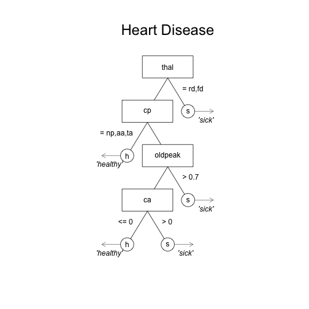
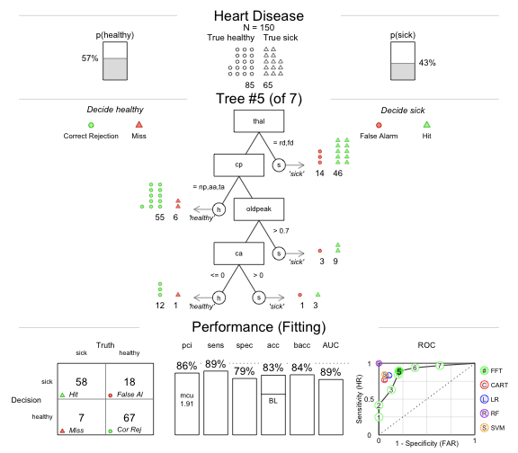
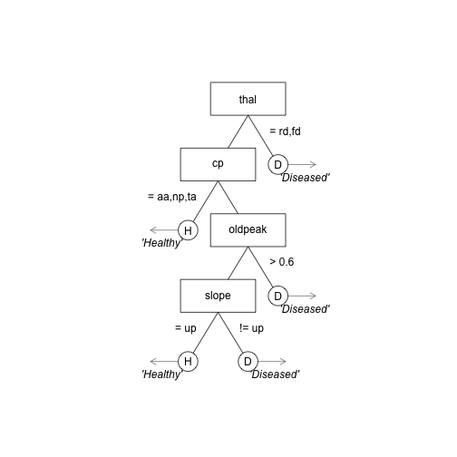

## A growing problem at the Cook County Hospital in 1996


--- .class #id 

## Patient overload


--- 


## Diagnosing ER patients with chest pain.

<!-- A significant number of those people filing into the ED—on average, about thirty a day—were worried that they were having a heart attack.  Chest-pain patients were resource-intensive. The treatment protocol was long and elaborate and—worst of all—maddeningly inconclusive. -->


### Situation

> - 30 people a day worried about a heart attack. 
> - Coronary care bed costs $2,000 a night and requires a 3 day stay.

### Decision task

> - Send true heart attacks to the coronary care bed, and true healthy patients to a normal bed.

### Multiple, uncertain measures

> - Electrocardiogram (ECG), Blood pressure, Stethescope,
> - Questions: How long? How much? During exercise? History? Cholesterol? Drugs? etc.


--- .class #id 

## Decisions by intuition was not working

> - Task: Estimate from 0 to 100 the probability of a heart attack of 20 separate patients.


--- #blockquote

## Conclusion: Terribly low agreement

"In each case the answers we got pretty much ranged from 0 to 100. It was extraordinary" (Brenden Reilly, Department of Medicine chairman)


--- .class #id 

## Solution

- A fast and frugal decision tree (FFT) developed by a cardiologist named Lee Goldman.


### Why use a fast and frugal tree?

> - Speed, Easy of understanding and implementation

--- 

## The Cook hospital decision tree

> - Over two years, the performance of the tree was compared to the physician's intuitive judgments.

### Results

> - Doctor's intuitive accuracy: 75-90%
> - Decision tree accuracy: 95%
> - Tree had far fewer false-positives and huge cost savings
> - To this day, the tree is still used at the hospital.


---  &twocol

*** =left
## Standard decision tree

> - Standard decision trees created by unrestricted algorithms can become very complex

> - Complexity -> High costs, Difficult to understand, prone to overfitting. 


*** =right

## Fast and Frugal tree

> - A fast and frugal decision tree (FFT) is a very simple, highly restricted decision tree where each node has exactly two branches, where at least one branch is an exit branch (Martignon et al., 2008).

> - FFTs -> Cheap, easy to understand, and rarely overfit.


<!-- --- .class #id  -->

<!-- ## Depression Tree -->

<!-- - Jenny et al. (2013): Simple rules for detecting depression -->

<!-- ```{r , fig.margin = TRUE, echo = FALSE, out.width = "40%", fig.align='center'} -->
<!-- knitr::include_graphics(c("images/depressiontree.png")) -->
<!-- ``` -->

<!-- --- .class #id  -->

<!-- ## Bank failure -->

<!-- - Neth et al. (2013): Homo heuristics in the financial world: From risk management to managing uncertainty -->

<!-- ```{r , fig.margin = TRUE, echo = FALSE, out.width = "40%", fig.align='center'} -->
<!-- knitr::include_graphics(c("images/nethtree.png")) -->
<!-- ``` -->

<!-- --- &twocol -->

<!-- ## Patient success -->

<!-- *** =left -->


<!-- ### FFT -->
<!-- ```{r echo = FALSE} -->
<!-- library(FFTrees) -->
<!-- plot(tree.63.m, stats = FALSE, tree = 5) -->
<!-- ``` -->


<!-- *** =right -->


<!-- ### rpart tree -->
<!-- ```{r echo = FALSE} -->
<!-- plot(rpart.63) -->
<!-- text(rpart.63) -->
<!-- ``` -->

--- .class #id 
## Problem

> - There is no off-the-shelf method to construct FFTs.
> - Previous researchers have individually constructed their FFTs.

### Task
> - Create an easy-to-use R package that constructs, visualizes, and implements FFTs.


--- .class #id 
## FFTrees


```r
# v1.1.8 available on CRAN
install.packages("FFTrees")

# v1.2.0 on github
devtools::github("ndphillips/FFTrees", include_vignette = TRUE)
```


--- .class #id 
## Heart disease datatset


```r
library(FFTrees)

head(heartdisease)
```

```
##     age sex cp trestbps chol fbs restecg thalach exang oldpeak slope ca
## 165  48   1 np      124  255   1  normal     175     0     0.0    up  2
## 264  44   1 np      120  226   0  normal     169     0     0.0    up  0
## 244  61   1 ta      134  234   0  normal     145     0     2.6  flat  2
## 47   51   1 np      110  175   0  normal     123     0     0.6    up  0
## 15   52   1 np      172  199   1  normal     162     0     0.5    up  0
## 226  34   0 aa      118  210   0  normal     192     0     0.7    up  0
##       thal diagnosis
## 165 normal         0
## 264 normal         0
## 244 normal         1
## 47  normal         0
## 15      rd         0
## 226 normal         0
```

--- .class #id 
## Creating a Heart Disease FFT


```r
# Step 1: Create training and test data
set.seed(100)

heartdisease <- heartdisease[sample(nrow(heartdisease)),]
heart.train <- heartdisease[1:150,]
heart.test <- heartdisease[151:303,]

# Step 2: Create heart.fft
heart.fft <- FFTrees(formula = diagnosis ~.,
                     data = heart.train,
                     data.test = heart.test)
```

<!-- --- .class #id  -->
<!-- ## Evaluating a decision algorithm -->


<!-- ```{r , fig.margin = TRUE, echo = FALSE, out.width = "60%", fig.align='center'} -->
<!-- knitr::include_graphics(c("images/confusiontable.png")) -->
<!-- ``` -->


--- .class #id 
## FFT summary statistics


```r
# Step 3: Summary statistics
heart.fft
```

```
## [1] "7 FFTs using up to 4 of 13 cues"
## [1] "FFT #5 uses 4 cues {thal,cp,oldpeak,ca} with the following performance:"
##       train   test
## n    150.00 153.00
## pci    0.86   0.87
## mcu    1.91   1.76
## acc    0.83   0.76
## bacc   0.84   0.76
## sens   0.89   0.86
## spec   0.79   0.66
```

--- .class #id 
## Heart Disease FFT

```r
plot(heart.fft, 
     main = "Heart Disease", 
     decision.names = c("healthy", "sick"),
     stats = FALSE)
```




--- .class #id 
## Heart Disease FFT

```r
plot(heart.fft, 
     main = "Heart Disease", 
     decision.names = c("healthy", "sick"))
```

...

--- .class #id 
## Heart Disease FFT | Training


--- .class #id 
## Heart Disease FFT | Prediction


--- .class #id 
## Heart Disease FFT | ROC


--- .class #id 
## Heart Disease FFT | Tree 4


--- .class #id 
## Heart Disease FFT | Tree 3


--- .class #id
## Heart Disease FFT | Tree 6


<!-- --- .class #id  -->
<!-- ## How do FFTs compare to regression and CART? -->

<!-- - Simplicity: *How much information is used and how is it combined?* -->
<!-- - Accuracy: *How well can the algorithm predict new data?* -->

<!-- --- .class #id  -->
<!-- ## Heart disease: regression -->
<!-- - 4 significant cues: (sex, cp, trestbps, ca) -->

<!-- ```{r echo = FALSE, fig.width = 10, fig.height = 6, fig.align = 'center'} -->
<!-- heart.lm <- glm(diagnosis ~., data = heartdisease, family = "binomial") -->
<!-- #heart.lm$coefficients -->
<!-- #summary(heart.lm)$coefficients -->

<!-- bar.cols <- rep("white", nrow(summary(heart.lm)$coefficients)) -->
<!-- bar.cols[summary(heart.lm)$coefficients[,4] < .05] <- yarrr::piratepal("basel", trans = .6, length.out = sum(summary(heart.lm)$coefficients[,4] < .05)) -->

<!-- barplot(height = abs(summary(heart.lm)$coefficients[,3]),  -->
<!--         names.arg = rownames(summary(heart.lm)$coefficients), -->
<!--         col = bar.cols, ylab = "Coefficient z-scores", main = "Heart Disease logistic regression") -->

<!-- abline(h = 1.96) -->

<!-- ``` -->


--- .class #id 
## Comparing FFTs to standard trees


### How does the FFT created by FFTrees compare to a 'standard' decision tree created by rpart?


--- &twocol

*** =left
## Heart disease: rpart

- 8 cues (thal, cp, oldpeak, ca, age, exang, thalach, chol)


**** =right
## Heart disease: FFT

> - 3 cues (thal, cp, ca)


<!-- |     |  train|   test| -->
<!-- |:----|------:|------:| -->
<!-- |n    | 150.00| 153.00| -->
<!-- |pci  |   0.87|   0.88| -->
<!-- |mcu  |   1.87|   1.62| -->
<!-- |acc  |   0.81|   0.80| -->
<!-- |bacc |   0.79|   0.79| -->
<!-- |sens |   0.63|   0.63| -->
<!-- |spec |   0.95|   0.94| -->

> - The FFT is very cheap to implement
>    - Heart disease FFT: $75.91
>    - Regression: $300 


<!-- ```{r, eval = TRUE, fig.align = 'center', echo = FALSE} -->
<!-- plot(heart.fft,  -->
<!--      main = "Heart Disease",  -->
<!--      decision.names = c("healthy", "sick"), -->
<!--      stats = FALSE) -->
<!-- ``` -->


--- .class #id
## Heart disease classification accuracy


--- .class #id
## Heart disease classification accuracy


--- .class #id
## Heart disease classification accuracy


--- .class #id 
## How accurate are FFTs built by FFTrees?

- Prediction competition
    - 10 datasets taken from the UCI machine learning database
    - 50% Fitting / 50% Prediction subsample splitting, DV: balanced accuracy = (sensitivity + specificity) / 2

|dataset     | cases| cues| base.rate|
|:-----------|-----:|----:|---------:|
|arrhythmia  |    68|  280|      0.29|
|audiology   |   226|   70|      0.10|
|breast      |   683|   10|      0.35|
|bridges     |    92|   10|      0.39|
|cmc         |  1473|   10|      0.35|

Table: 5 of the 10 prediction datasets

--- .class #id 
## Aggregate simulation prediction results


--- .class #id 
## Aggregate simulation prediction results


--- .class #id 
## Aggregate simulation prediction results


--- .class #id 
## Simulation prediction results by dataset


--- &twocol

*** =left

## Conclusions

> - FFTrees makes it easy to develop simple, effective, transparent decision trees.
> - FFTrees can compete with complex decision algorithms, even Random Forests and Support Vector machines, in pure prediction.


## Next steps


> - Speed up code with c++ or Julia.
> - Include *cue costs* into algorithm.
> - Quantify when and how a tree **fails** when it is applied to data over time.

*** =right


--- .class #id 
## Questions?




--- .class #id 
## FFForest()


```r
plot(heart.fff)
```




--- .class #id 
## Heart disease cue accuracies


```r
plot(heart.fft, what = "cues", main = "Heart Disease")
```


