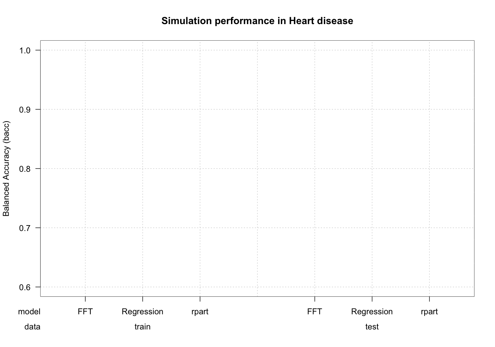
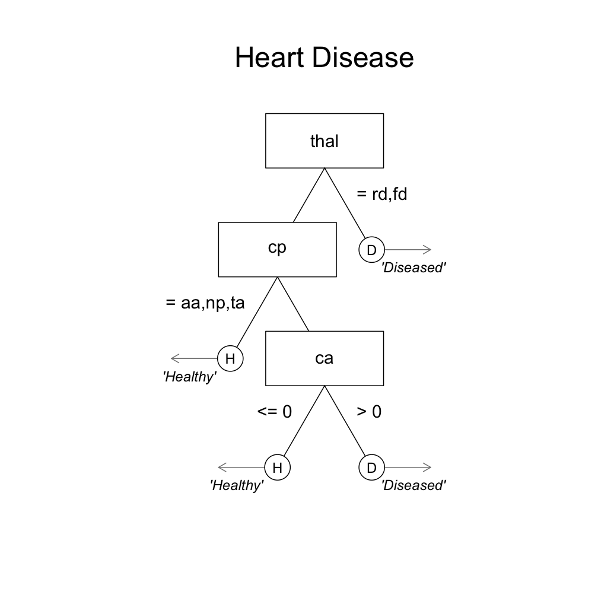
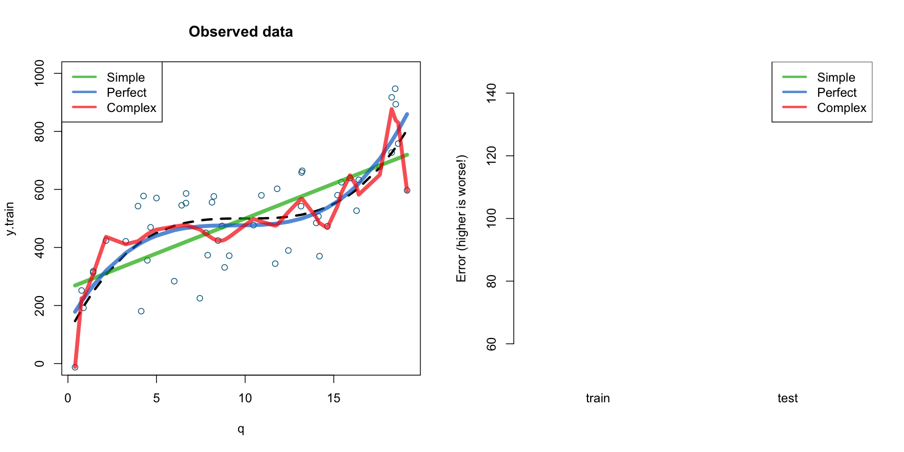
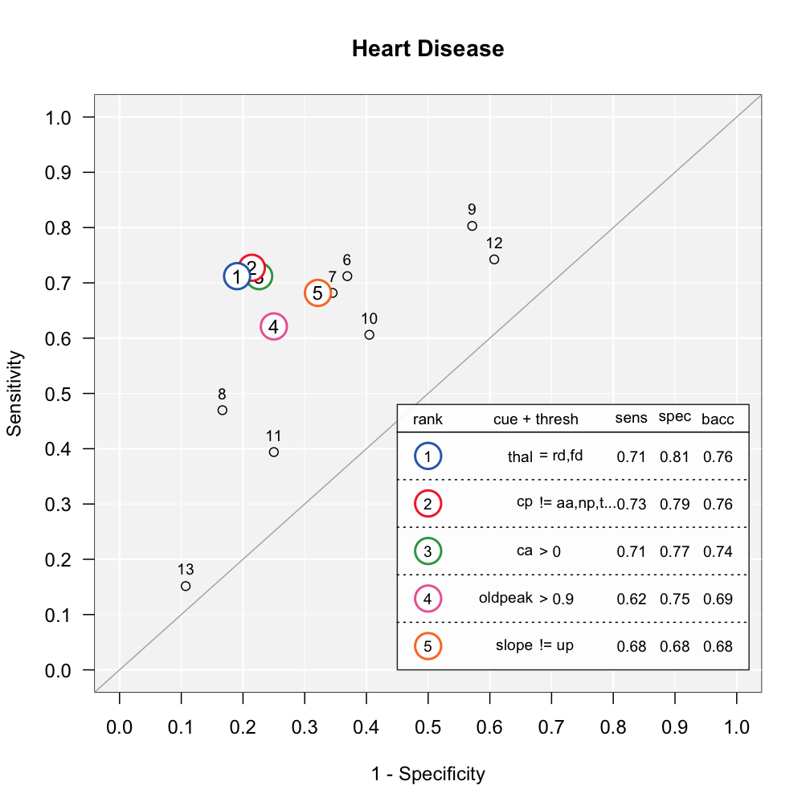

## A growing problem at the Cook County Hospital in 1996


--- .class #id 

## Emergency Room overload


--- &twocol

*** =left

## Heart attacks (?)

<!-- A significant number of those people filing into the ED—on average, about thirty a day—were worried that they were having a heart attack.  Chest-pain patients were resource-intensive. The treatment protocol was long and elaborate and—worst of all—maddeningly inconclusive. -->

- 30 people a day worried about a heart attack
- **Coronary care bed** ($2,000 a night + 3 day stay) or **Regular bed**
- Goal: send true heart attacks to the coronary care bed, and true healthy patients to a normal bed.

### Multiple, uncertain measures

- Electrocardiogram (ECG), Blood pressure, Stethescope, How long? How much? During exercise? History? Cholesterol? Drugs? etc.


*** =right


--- .class #id 

## How good were doctor's intuitive decisions?

- Task: Estimate from 0 to 100 the probability of a heart attack of 20 separate patients.


--- .class #id 

## Answer: Not consistent at all

### "In each case the answers we got pretty much ranged from 0 to 100. It was extraordinary" ~ Department of Medicine chairman


### The problem

- Too much inconsistency in doctor's decisions
- Too many healthy people sent to the coronary care unit.


--- .class #id 

## Solution

- A fast and frugal decision tree (FFT) developed by a cardiologist named Lee Goldman.


### Why use a decision tree?

> - Easy to understand, consistent, requires little information, can be calculated 'in the head'


--- .class #id 


---  &twocol

*** =left

## The Cook hospital decision tree

- Over two years, the performance of the tree was compared to the physician's intuitive judgments.

### Results

> - Doctor's accuracy: 75-90%
> - Decision tree accuracy: 95%
> - Tree had far fewer false-positives and huge cost savings
> - To this day, the tree is still used at the hospital.

*** =right


---  &twocol

*** =left

## Fast and Frugal tree

> - A fast and frugal decision tree (FFT) is a decision tree where each node has exactly two branches, where at least one branch is an exit branch (Martignon et al., 2008).

> - FFTs -> Cheap, easy to understand, and rarely overfit.


*** =right

## Standard decision tree

> - "Standard"" decision trees can become very complex.

> - Complexity -> High costs, Difficult to understand, prone to overfitting. 


<!-- --- .class #id  -->

<!-- ## Depression Tree -->

<!-- - Jenny et al. (2013): Simple rules for detecting depression -->

<!-- ```{r , fig.margin = TRUE, echo = FALSE, out.width = "40%", fig.align='center'} -->
<!-- knitr::include_graphics(c("images/depressiontree.png")) -->
<!-- ``` -->

<!-- --- .class #id  -->

<!-- ## Bank failure -->

<!-- - Neth et al. (2013): Homo heuristics in the financial world: From risk management to managing uncertainty -->

<!-- ```{r , fig.margin = TRUE, echo = FALSE, out.width = "40%", fig.align='center'} -->
<!-- knitr::include_graphics(c("images/nethtree.png")) -->
<!-- ``` -->

<!-- --- &twocol -->

<!-- ## Patient success -->

<!-- *** =left -->


<!-- ### FFT -->
<!-- ```{r echo = FALSE} -->
<!-- library(FFTrees) -->
<!-- plot(tree.63.m, stats = FALSE, tree = 5) -->
<!-- ``` -->


<!-- *** =right -->


<!-- ### rpart tree -->
<!-- ```{r echo = FALSE} -->
<!-- plot(rpart.63) -->
<!-- text(rpart.63) -->
<!-- ``` -->

--- .class #id 
## Problem

- There is no off-the-shelf method to construct FFTs.
  - Previous researchers have individually constructed their FFTs.

### Task
- Create an easy-to-use R package that constructs, visualizes, and implements FFTs.


--- .class #id 
## FFTrees


```r
# v1.1.8 available on CRAN
install.packages("FFTrees")

# v1.2.0 on github
devtools::github("ndphillips/FFTrees", include_vignette = TRUE)
```


--- .class #id 
## Heart disease datatset


```r
library(FFTrees)

head(heartdisease)
```

```
##   age sex cp trestbps chol fbs     restecg thalach exang oldpeak slope ca
## 1  63   1 ta      145  233   1 hypertrophy     150     0     2.3  down  0
## 2  67   1  a      160  286   0 hypertrophy     108     1     1.5  flat  3
## 3  67   1  a      120  229   0 hypertrophy     129     1     2.6  flat  2
## 4  37   1 np      130  250   0      normal     187     0     3.5  down  0
## 5  41   0 aa      130  204   0 hypertrophy     172     0     1.4    up  0
## 6  56   1 aa      120  236   0      normal     178     0     0.8    up  0
##     thal diagnosis
## 1     fd         0
## 2 normal         1
## 3     rd         1
## 4 normal         0
## 5 normal         0
## 6 normal         0
```

--- .class #id 
## 4 Steps to using FFTrees


```r
# Step 1: Create the trees
heart.fft <- FFTrees(formula = diagnosis ~., 
                     data = heart.train,
                     data.test = heart.test)

# Step 2: View summary statistics
print(heart.fft)

# Step 3: Visualise the tree
plot(heart.fft, data = "train")   # Training statistics
plot(herat.fft, data = "test")    # Test statistics
```


--- .class #id 
## Step 1: Create an FFTrees object


```r
# Step 0: Create training and test data
set.seed(100)

heartdisease <- heartdisease[sample(nrow(heartdisease)),]
heart.train <- heartdisease[1:150,]
heart.test <- heartdisease[151:303,]

# Step 1: Create heart.fft
heart.fft <- FFTrees(formula = diagnosis ~.,
                     data = heart.train,
                     data.test = heart.test)
```

<!-- --- .class #id  -->
<!-- ## Evaluating a decision algorithm -->


<!-- ```{r , fig.margin = TRUE, echo = FALSE, out.width = "60%", fig.align='center'} -->
<!-- knitr::include_graphics(c("images/confusiontable.png")) -->
<!-- ``` -->


--- .class #id 
## Printing an FFTrees object


```r
# Step 2: Summary statistics
heart.fft
```

```
## [1] "7 FFTs using up to 4 of 13 cues"
## [1] "FFT #4 uses 3 cues {thal,cp,ca} with the following performance:"
##       train   test
## n    150.00 153.00
## pci    0.88   0.88
## mcu    1.74   1.73
## acc    0.80   0.82
## bacc   0.80   0.82
## sens   0.82   0.88
## spec   0.79   0.76
```

--- &twocol

*** =left

## Plotting an FFTrees object

`plot(heart.fft, stats = FALSE)`


*** =right

### 3 cues


| cue| cost | description|values |
|:------|:---|:----|:-----|
|     `thal`| $102 | thallium scintigraphy, a nuclear imaging test that shows how well blood flows into the heart.|normal (n), fixed defect (fd), reversible defect (rd)     |
|     `cp`| $1 |    Chest pain type| Typical angina (ta), atypical angina (aa), non-anginal pain (np), asymptomatic (a)     |
|     `ca`| $101 | Number of major vessels colored by flourosopy, a continuous x-ray imaging tool|0, 1, 2 or 3 |


--- .class #id 
#### `plot(heart.fft)`


--- .class #id 
#### `plot(heart.fft, data = "test")`


--- .class #id 
## Heart Disease FFT | ROC


--- .class #id 
#### `plot(heart.fft, data = "test")`


--- .class #id 
#### `plot(heart.fft, data = "test", tree = 3)`


--- .class #id
#### `plot(heart.fft, data = "test", tree = 6)`


<!-- --- .class #id  -->
<!-- ## How do FFTs compare to regression and CART? -->

<!-- - Simplicity: *How much information is used and how is it combined?* -->
<!-- - Accuracy: *How well can the algorithm predict new data?* -->

<!-- --- .class #id  -->
<!-- ## Heart disease: regression -->
<!-- - 4 significant cues: (sex, cp, trestbps, ca) -->

<!-- ```{r echo = FALSE, fig.width = 10, fig.height = 6, fig.align = 'center'} -->
<!-- heart.lm <- glm(diagnosis ~., data = heartdisease, family = "binomial") -->
<!-- #heart.lm$coefficients -->
<!-- #summary(heart.lm)$coefficients -->

<!-- bar.cols <- rep("white", nrow(summary(heart.lm)$coefficients)) -->
<!-- bar.cols[summary(heart.lm)$coefficients[,4] < .05] <- yarrr::piratepal("basel", trans = .6, length.out = sum(summary(heart.lm)$coefficients[,4] < .05)) -->

<!-- barplot(height = abs(summary(heart.lm)$coefficients[,3]),  -->
<!--         names.arg = rownames(summary(heart.lm)$coefficients), -->
<!--         col = bar.cols, ylab = "Coefficient z-scores", main = "Heart Disease logistic regression") -->

<!-- abline(h = 1.96) -->

<!-- ``` -->


--- .class #id 
## Comparing FFTs to standard trees


### How does the FFT created by FFTrees compare to a 'standard' decision tree created by rpart?


--- &twocol

*** =left
## Heart disease: rpart

- 8 predictors, 3 - 5 required to make decisions


**** =right
## Heart disease: FFT

- 3 predictors, only 1 - 3 required to make decisions

- The FFT is very cheap to implement
    - Regression: $300
    - rpart: > $100
    - Heart disease FFT: $75.91


--- .class #id
## Heart disease classification accuracy





--- .class #id
## Heart disease classification accuracy


--- .class #id
## Heart disease classification accuracy


--- .class #id 
## How accurate are FFTs built by FFTrees?

- Prediction competition
    - 10 datasets taken from the UCI machine learning database
    - 50% Fitting / 50% Prediction subsample splitting, DV: balanced accuracy = (sensitivity + specificity) / 2

|dataset     | cases| cues| base.rate|
|:-----------|-----:|----:|---------:|
|arrhythmia  |    68|  280|      0.29|
|audiology   |   226|   70|      0.10|
|breast      |   683|   10|      0.35|
|bridges     |    92|   10|      0.39|
|cmc         |  1473|   10|      0.35|

Table: 5 of the 10 prediction datasets

--- .class #id 
## Aggregate simulation prediction results


--- .class #id 
## Aggregate simulation prediction results


--- .class #id 
## Aggregate simulation prediction results


--- .class #id 
## Simulation prediction results by dataset


--- &twocol

*** =left

## Conclusions

- FFTrees makes it easy to create simple, effective, transparent fast and frugal decision trees (FFTs).

- FFTs can predict data "as well" as complex algorithms that use much more information.

## Next steps

- Speed up code with c++ or Julia.
- Include *cue costs* into algorithm.
- Quantify when a tree **fails** over time.

*** =right


```r
# Create FFTs in one line of code
FFTrees(diagnosis ~., 
        data = heartdisease)
```




--- 

## Please help and contribute!

- I am very happy for contributions and bug reports at [http://www.github.com/ndphillips/FFTrees](http://www.github.com/ndphillips/FFTrees), 

- If you have data you want to try `FFTrees` on, or can think of new features, let's collaborate!


[](https://www.revive-adserver.com/media/GitHub.jpg)


--- &twocol

*** =left

## Questions?


*** =right

## Contact

### Website
### http://ndphillips.github.io

### Email
### Nathaniel.D.Phillips.is@gmail.com


### This talk
### http://ndphillips.github.io/BaselR


--- .class #id 

## Fitting vs. Prediction


--- .class #id 

## Fitting vs. Prediction




--- .class #id 

## Fitting vs. Prediction


--- .class #id 

## Fitting vs. Prediction


--- &twocol

*** =left
## FFTrees algorithm

1. Calculate a decision threshold `t` for each cue that maximizes the cue’s balanced accuracy `bacc` in training.

2. Rank cues in order of their maximum balanced accuracy -- select the top N cues. 

3. Creates all possible `2^{N−1}` trees with these cues, using all exit structures.

*** =right


--- .class #id 
## FFForest()

### Visualise cue importance and co-occurence


--- .class #id 
## Heart disease cue accuracies


```r
plot(heart.fft, what = "cues", main = "Heart Disease")
```




