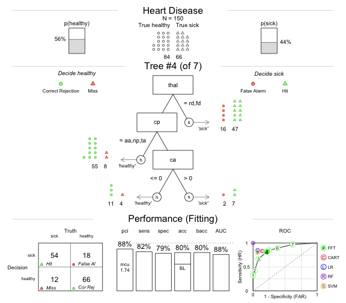

## A growing problem at the Cook County Hospital in 1996


--- .class #id 

## Patient overload


<!-- As the city’s principal public hospital, Cook County was the place of last resort for the hundreds of thousands of Chicagoans without health insurance. Resources were stretched to the limit. The hospital’s cavernous wards were built for another century. There were no private rooms, and patients were separated by flimsy plywood dividers. There was no cafeteria or private telephone—just a payphone for everyone at the end of the hall. In one possibly apocryphal story, doctors once trained a homeless man to do routine lab tests because there was no one else available. -->

<!-- > But the Emergency Department (the ED) seemed to cry out for special attention. The rooms were jammed. A staggering 250,000 patients came through the ED every year. How do you figure out who needs what? How do you figure out how to direct resources to those who need them the most?” -->


--- 


## Diagnosing ER patients with chest pain.

<!-- A significant number of those people filing into the ED—on average, about thirty a day—were worried that they were having a heart attack.  Chest-pain patients were resource-intensive. The treatment protocol was long and elaborate and—worst of all—maddeningly inconclusive. -->


### Situation

> - 30 people a day worried about a heart attack. 
> - Coronary care bed costs $2,000 a night and requires a 3 day stay.

### Decision task

> - Send people with heart attacks to the coronary care bed, and healthy patients to a normal bed.

### Multiple, uncertain measures

> - Blood pressure, Stethescope,
> - Questions: How long? How much? During exercise? History? Cholesterol? Drugs? etc.
> - Electrocardiogram (ECG) reading.


--- .class #id 

## Intuition based on clinical expertise was not working.

### Study: How much do doctors agree on diagnoses?

> - Asked doctors to estimate from 0 to 100 the probability of a heart attack of 20 separate patients.


--- #blockquote

## Conclusion: Terribly low agreement

### "In each case the answers we got pretty much ranged from 0 to 100. It was extraordinary" (Brenden Reilly, Department of Medicine chairman)


--- .class #id 

## Solution

- A decision tree developed by a cardiologist named Lee Goldman.


### Why use a decision tree?

- Speed, Easy of understanding and implementation


--- &twocol

*** =left

## The Cook hospital decision tree

- Over two years, the performance of the tree was compared to the physician's intuitive judgments.

### Results

- Tree dramatically outperformed the doctor's clinical judgments and resulted in far fewer false-positives and huge cost savings

- To this day, the tree is still used at the hospital.

*** =right


---  &twocol

*** =left
## Fast and frugal decision trees (FFT)

- A fast and frugal decision tree (FFT) is a very simple, highly restricted decision tree.

- In an FFT, each node has exactly two branches, where at least one branch is an exit branch (Martignon et al., 2008).

- Because of their restrictions, FFTs are even faster and require less information than non-FFT trees.

*** =right


--- .class #id 

## Depression Tree

- Jenny et al. (2013): Simple rules for detecting depression


--- .class #id 

## Bank failure

- Neth et al. (2013): Homo heuristics in the financial world: From risk management to managing uncertainty


<!-- --- &twocol -->

<!-- ## Patient success -->

<!-- *** =left -->


<!-- ### FFT -->
<!-- ```{r echo = FALSE} -->
<!-- library(FFTrees) -->
<!-- plot(tree.63.m, stats = FALSE, tree = 5) -->
<!-- ``` -->


<!-- *** =right -->


<!-- ### rpart tree -->
<!-- ```{r echo = FALSE} -->
<!-- plot(rpart.63) -->
<!-- text(rpart.63) -->
<!-- ``` -->

--- .class #id 
## Problem

There is no off-the-shelf method to construct FFTs

### Task
- Create an easy-to-use R package that constructs, visualizes, and implements FFTs called `FFTrees`.


--- .class #id 
## FFTrees


```r
# Available on CRAN
install.packages("FFTrees")
devtools::github("ndphillips/FFTrees", include_vignette = TRUE)
```


--- .class #id 
## Heart disease datatset


```r
library(FFTrees)

head(heartdisease)
```

```
##   age sex cp trestbps chol fbs     restecg thalach exang oldpeak slope ca
## 1  63   1 ta      145  233   1 hypertrophy     150     0     2.3  down  0
## 2  67   1  a      160  286   0 hypertrophy     108     1     1.5  flat  3
## 3  67   1  a      120  229   0 hypertrophy     129     1     2.6  flat  2
## 4  37   1 np      130  250   0      normal     187     0     3.5  down  0
## 5  41   0 aa      130  204   0 hypertrophy     172     0     1.4    up  0
## 6  56   1 aa      120  236   0      normal     178     0     0.8    up  0
##     thal diagnosis
## 1     fd         0
## 2 normal         1
## 3     rd         1
## 4 normal         0
## 5 normal         0
## 6 normal         0
```

--- .class #id 
## Creating a Heart Disease FFT


```r
# Step 1: Create training and test data
set.seed(100)

heartdisease <- heartdisease[sample(nrow(heartdisease)),]
heart.train <- heartdisease[1:150,]
heart.test <- heartdisease[151:303,]

# Step 2: Create heart.fft
heart.fft <- FFTrees(formula = diagnosis ~.,
                     data = heart.train,
                     data.test = heart.test)
```

--- .class #id 
## Evaluating a decision algorithm


--- .class #id 
## FFT summary statistics


```r
# Step 3: Summary statistics
heart.fft
```

```
## [1] "7 FFTs using up to 4 of 13 cues"
## [1] "FFT #4 uses 3 cues {thal,cp,ca} with the following performance:"
##       train   test
## n    150.00 153.00
## pci    0.88   0.88
## mcu    1.74   1.73
## acc    0.80   0.82
## bacc   0.80   0.82
## sens   0.82   0.88
## spec   0.79   0.76
```

--- .class #id 
## Heart disease cue accuracies


```r
plot(heart.fft, what = "cues", main = "Heart Disease")
```


--- .class #id 
## Heart Disease FFT

```r
plot(heart.fft, main = "Heart Disease", 
     decision.names = c("healthy", "sick"),
     stats = FALSE)
```


--- .class #id 
## Heart Disease FFT - Training


--- .class #id 
## Heart Disease FFT - Prediction


--- .class #id 
## Heart Disease FFT - Tree 3


--- .class #id
## Heart Disease FFT - Tree 6


--- .class #id 
## How do FFTs compare to regression and CART?

- Simplicity: *How much information is used and how is it combined?*
- Accuracy: *How well can the algorithm predict new data?*

--- .class #id 
## Heart disease: regression
- 4 significant cues: (sex, cp, trestbps, ca)


--- .class #id 
## Heart disease: rpart

- 8 cues (thal, cp, oldpeak, ca, age, exang, thalach, chol)


--- .class #id 
## Heart disease: FFT

- 3 cues (thal, cp, ca)
- However, when applied to the data, only about 1.75 cues are even used on average. As a result, > 85% of the cue information is completely ignored.




--- .class #id 
## Heart disease classification accuracy


--- .class #id 
## Heart disease classification accuracy


--- .class #id 
## Heart disease classification accuracy


--- .class #id 
## How accurate are FFTs built by FFTrees?

- Prediction competition
    - 10 datasets taken from the UCI machine learning database
    - 50% Fitting / 50% Prediction subsample splitting, DV: balanced accuracy = (sensitivity + specificity) / 2

|dataset     | cases| cues| base.rate|
|:-----------|-----:|----:|---------:|
|arrhythmia  |    68|  280|      0.29|
|audiology   |   226|   70|      0.10|
|breast      |   683|   10|      0.35|
|bridges     |    92|   10|      0.39|
|cmc         |  1473|   10|      0.35|

Table: 5 of the 10 prediction datasets

--- .class #id 
## Aggregate simulation prediction results


--- .class #id 
## Aggregate simulation prediction results


--- .class #id 
## Aggregate simulation prediction results


--- .class #id 
## Simulation prediction results by dataset


--- &twocol

*** =left

## Conclusions

> - FFTrees makes it easy to develop simple, effective, transparent decision trees.
> - Decision aids built with FFTrees can compete with complex, compensatory algorithms in prediction.


## Next steps


> - Speed up code with c++ or Julia.
> - Include *cue costs* into algorithm.
>    - Heart disease FFT: $75.91
>    - Regression: $300 
> - Quantify when and how a tree **fails** when it is applied to data over time.

*** =right


--- .class #id 
## Questions?


--- .class #id 
## Tree construction algorithm

| Step| Time|
|:------|:----|
|     1. Decision threshold for each cue|    |
|     2. Select cues|    2|
|     3. Order cues|    4|
|     4. Exit branch|    6|


--- .class #id 
## Exploring trees with FFForest()

- The `FFForest()` function will create a forest of FFTs by creating trees from random subsets of the data.

- You can then extrapolate cue importance and co-occurence from an `FFForest` object:


